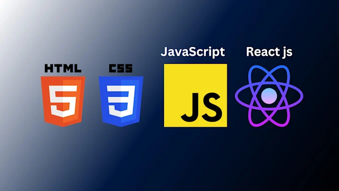

# 📋 Detailed Project Report — Personal Portfolio Website

**Author:** Kokkilagadda Abhishek  
**GitHub:** [KAbhishek2526](https://github.com/KAbhishek2526)  
**Contact:** kokkiligaddaabhishek2006@gmail.com  
**Date:** March 19, 2026  
**Status:** Complete & Deployed

---

## 1. Project Overview

This is a personal portfolio website built entirely from scratch using **HTML, CSS, JavaScript, and Bootstrap 5**. It is a single-page application (SPA) designed to showcase the developer's profile, projects, and contact information with a sleek, modern dark-themed UI featuring animated firefly effects.

### Purpose
- Serve as a professional online presence for Kokkilagadda Abhishek.
- Showcase technical skills and projects.
- Provide a contact mechanism for visitors.
- Demonstrate frontend development capabilities.

### Live Deployment
- **GitHub Repository:** https://github.com/KAbhishek2526/portfolio
- **GitHub Pages URL:** https://KAbhishek2526.github.io/portfolio

---

## 2. Technology Stack

| Technology | Version | Purpose |
|------------|---------|---------|
| HTML5 | — | Page structure and semantic markup |
| CSS3 | — | Custom styling, animations, glassmorphism |
| JavaScript (ES6+) | — | Interactivity, dynamic effects, smooth scrolling |
| Bootstrap | 5.3.0 | Responsive grid, navbar, form components, cards |
| Google Fonts | — | Montserrat font family |
| Font Awesome | 6.4.2 | Icons (envelope, GitHub, user-circle) |

### External Dependencies (via CDN)
- `https://cdn.jsdelivr.net/npm/bootstrap@5.3.0/dist/css/bootstrap.min.css`
- `https://cdn.jsdelivr.net/npm/bootstrap@5.3.0/dist/js/bootstrap.bundle.min.js`
- `https://fonts.googleapis.com/css2?family=Montserrat:wght@400;700&display=swap`
- `https://cdnjs.cloudflare.com/ajax/libs/font-awesome/6.4.2/css/all.min.css`

**No build tools, bundlers, or package managers are required.** This is a purely static website.

---

## 3. Project File Structure

```
portfolio/
├── index.html                                      (5,607 bytes — Main HTML page)
├── style.css                                       (14,822 bytes — All styles & animations)
├── main.js                                         (1,799 bytes — JavaScript logic)
├── portfolio.personal image.jpg                    (52,321 bytes — Profile photo)
├── convert-figma-to-html-css-javascript-react-js-and-next-js.webp
│                                                   (15,058 bytes — Project card image)
├── README.md                                       (1,673 bytes — Repository readme)
└── PROJECT_REPORT.md                               (This file)
```

**Total project size:** ~91 KB (excluding this report)  
**Total files:** 6

---

## 4. Detailed File-by-File Breakdown

### 4.1. `index.html` — Main HTML Page (142 lines)

The single HTML page that contains the full website structure. Key sections:

#### Head Section
- Character set: UTF-8
- Viewport: responsive (`width=device-width, initial-scale=1`)
- Title: "ABHISHEK K | Portfolio"
- External CSS: Bootstrap 5.3.0, Google Fonts (Montserrat), Font Awesome 6.4.2, custom `style.css`

#### Body Structure

**a) Firefly Background (`#fireflies` + `#dynamic-fireflies`)**
- 15 static `<div class="firefly">` elements for ambient background animation.
- A `#dynamic-fireflies` container for mouse-cursor-triggered fireflies (created via JS).

**b) Navbar**
- Bootstrap 5 dark transparent navbar with collapse support for mobile.
- Brand: "KOKKILAGADDA ABHISHEK" with a user-circle icon.
- Navigation links: About Me, Projects, Contact (smooth scroll via JS).
- Mobile hamburger toggle using Bootstrap's `navbar-toggler`.

**c) About Me Section (`#about`)**
- Two-column Bootstrap row layout:
  - Left column: Circular profile photo (`portfolio.personal image.jpg`, 160×160px).
  - Right column: Glassmorphism card with personal introduction.
- Content includes role description, tech stack, interests, and personal motto.
- CTA buttons: "Mail me" (mailto link) and "GitHub" (external link).

**d) Projects Section (`#projects`)**
- Section heading centered.
- Project cards in a 3-column Bootstrap grid (`col-md-4`).
- Currently contains one project card:
  - Image: `convert-figma-to-html-css-javascript-react-js-and-next-js.webp`
  - Title: "Personal Portfolio"
  - Description: First web project summarizing what was built and learned.
  - Footer: GitHub link button to project repository.
- Structure supports easy addition of more project cards.

**e) Contact Section (`#contact`)**
- Centered single-column layout (`col-md-6 mx-auto`).
- Glassmorphism card containing a form with:
  - Name input (text, required)
  - Email input (email, required)
  - Message textarea (5 rows, required)
  - Submit button (full-width, blue primary button)
- Form submission is demo-only (alert popup, no backend).

#### Scripts
- Bootstrap JS Bundle (CDN)
- Custom `main.js`

---

### 4.2. `style.css` — Stylesheet (544 lines)

The full stylesheet containing design tokens, layout styles, component styles, and complex CSS animations.

#### Design System (CSS Custom Properties)

```css
--bg-dark: #13161a        /* Dark background */
--glass-bg: rgba(30,34,43,0.8)  /* Glassmorphism background */
--primary: #00aaff        /* Primary blue */
--accent: #ff4081         /* Accent pink */
--text-light: #fafaff     /* Light text */
--card-dark: #23272f      /* Dark card background */
--font-main: 'Montserrat', 'Segoe UI', Arial, sans-serif
```

#### Major Style Categories

**a) Body & Background**
- Full viewport minimum height.
- Background image with a dark gradient overlay (`linear-gradient` pseudo-element).
- Gradient: 95% dark on the left fading to subtle purple on the right.

**b) Navbar**
- Fully transparent background (`background: transparent !important`).
- Bold nav links (600 weight) with custom spacing.

**c) Glassmorphism Cards (`.card`, `.about-card`)**
- Semi-transparent dark background (`rgba(30,34,43,0.8)`).
- Rounded corners (`1rem`), strong shadow.
- Hover effect: lift up 5px + slight scale (1.03) + blue glow shadow.

**d) Buttons**
- Primary buttons: blue (`#00aaff`) → pink (`#ff4081`) on hover.
- Outline-light buttons for secondary actions.

**e) Form Inputs**
- Dark card background (#23272f) with light text and subtle border.

**f) Responsive Breakpoints**
- `@media (max-width: 767px)`: Smaller headings (1.6rem), reduced profile image (120px).

#### Animation System (Fireflies)

The firefly animation system is the most complex part of the CSS — **~430 lines** dedicated to animations.

**Static Fireflies (15 total):**
- Each firefly is a tiny dot (`0.1vw × 0.1vw`) with white background and yellow box-shadow glow.
- Fixed positioning, centered on page with margin offset.
- Each firefly has **3 layered animations**:
  1. **Movement** (`move1` through `move15`): 4-keyframe path using `translateX`, `translateY`, and `scale` transforms. Durations range from 193s to 208s for natural variation.
  2. **Drift/Rotation** (`drift` via `::before`): 360° rotation, 13s–21s duration.
  3. **Flash/Glow** (`flash` via `::after`): Pulsing yellow glow with varied delays (2.8s–8.5s) and durations (5.4s–9.7s).

**Dynamic Fireflies (cursor-following):**
- Created on mouse movement via JavaScript.
- 6px diameter, white with yellow glow, `opacity: 0.9`.
- `floatUp` animation: rise 80px upward while fading out over 3 seconds.

---

### 4.3. `main.js` — JavaScript Logic (55 lines)

Three distinct features implemented:

#### a) Dynamic Firefly System (Lines 1–37)
- **Container:** `#dynamic-fireflies` div.
- **Limit:** Maximum 100 fireflies on screen simultaneously.
- **Creation:** `createDynamicFirefly(x, y)` function:
  - Creates a `<div>` with class `dynamic-firefly`.
  - Positioned at mouse coordinates (centered with 3px offset).
  - Randomized animation duration: 2–4 seconds.
  - Appended to container, increments counter.
  - Self-removing via `animationend` event listener.
- **Performance:** Debounced to fire at most every 50ms via timestamp comparison on `mousemove`.

#### b) Smooth Scrolling (Lines 38–47)
- Intercepts all clicks on `.nav-link` elements.
- If `href` starts with `#`, prevents default and uses `scrollIntoView({ behavior: "smooth" })`.

#### c) Contact Form Handler (Lines 49–53)
- Listens for `submit` event on `#contactForm`.
- Prevents default form submission.
- Shows a demo alert: "Thanks! (Demo only. No backend configured.)"

---

## 5. Design & UX Analysis

### Visual Theme
- **Color Palette:** Dark mode with blue primary (#00aaff) and pink accent (#ff4081).
- **Typography:** Montserrat (Google Fonts) — modern, clean, geometric sans-serif.
- **Glass Effects:** Semi-transparent cards with blur-like appearance (glassmorphism trend).
- **Background:** Dark gradient overlay with purple tinge on the right side.

### Interactivity
- **Firefly animations:** 15 CSS-animated ambient fireflies + cursor-following dynamic fireflies.
- **Hover effects:** Cards lift and glow on hover.
- **Smooth scrolling:** Navbar links scroll smoothly to sections.
- **Responsive navbar:** Collapses to hamburger menu on mobile.

### Responsiveness
- Bootstrap 5 grid system ensures responsive layout.
- Media query adjustments for screens under 768px.
- Navbar collapse for mobile devices.

---

## 6. Strengths

| Strength | Details |
|----------|---------|
| **Clean, modern design** | Dark theme with glassmorphism and animated fireflies creates a visually appealing experience |
| **Lightweight** | ~91 KB total, no build tools or dependencies to install — pure static site |
| **Responsive** | Bootstrap grid + media queries ensure it works on all screen sizes |
| **Performance-conscious JS** | Firefly creation is debounced (50ms), capped at 100, and self-cleaning |
| **Easy to deploy** | Can be hosted on GitHub Pages, Netlify, or any static host with zero configuration |
| **Well-structured** | Separation of HTML, CSS, and JS into distinct files |

---

## 7. Areas for Improvement

### High Priority
| Area | Current State | Recommendation |
|------|---------------|----------------|
| **SEO** | Missing meta description, Open Graph tags | Add `<meta name="description">`, OG tags for social sharing |
| **Accessibility** | Missing alt text context, no ARIA labels | Add descriptive alt text, ARIA attributes, keyboard navigation |
| **Contact form** | Demo only (alert popup) | Integrate with Formspree, EmailJS, or a backend API |
| **More projects** | Only 1 project card displayed | Add more project cards with live demo links |

### Medium Priority
| Area | Current State | Recommendation |
|------|---------------|----------------|
| **Performance** | 15 firefly CSS keyframes = 430 lines | Consider generating animations via JS or using CSS Houdini |
| **Image optimization** | JPG profile photo (52 KB) | Convert to WebP, add lazy loading |
| **Skills section** | Not present | Add a visual skills/technologies section with progress bars or icons |
| **Resume/CV** | Not present | Add a downloadable PDF resume link |
| **Footer** | Not present | Add footer with copyright, social links, year |

### Low Priority
| Area | Current State | Recommendation |
|------|---------------|----------------|
| **Dark/Light toggle** | Dark only | Add theme toggle for user preference |
| **Animations on scroll** | None | Add fade-in/slide-up animations using Intersection Observer |
| **Analytics** | None | Add Google Analytics or Plausible for visitor tracking |
| **Blog section** | Not present | Consider adding a blog or "What I'm learning" section |
| **Favicon** | Not present | Add a custom favicon |

---

## 8. Source Code — Complete Listing

### 8.1. `index.html`

```html
<!DOCTYPE html>
<html lang="en">
<head>
  <meta charset="UTF-8" />
  <meta name="viewport" content="width=device-width, initial-scale=1" />
  <title>ABHISHEK K | Portfolio</title>
  <!-- Bootstrap 5 CDN -->
  <link href="https://cdn.jsdelivr.net/npm/bootstrap@5.3.0/dist/css/bootstrap.min.css" rel="stylesheet">
  <!-- Google Fonts (Modern, clean font) -->
  <link href="https://fonts.googleapis.com/css2?family=Montserrat:wght@400;700&display=swap" rel="stylesheet">
  <!-- Font Awesome for icons -->
  <link rel="stylesheet" href="https://cdnjs.cloudflare.com/ajax/libs/font-awesome/6.4.2/css/all.min.css">
  <!-- Custom CSS -->
  <link rel="stylesheet" href="style.css">
</head>
<body>
    <!--fire flies-->
    <!-- Firefly background animations -->
<div id="fireflies">
  <div class="firefly"></div>
  <div class="firefly"></div>
  <div class="firefly"></div>
  <div class="firefly"></div>
  <div class="firefly"></div>
  <div class="firefly"></div>
  <div class="firefly"></div>
  <div class="firefly"></div>
  <div class="firefly"></div>
  <div class="firefly"></div>
  <div class="firefly"></div>
  <div class="firefly"></div>
  <div class="firefly"></div>
  <div class="firefly"></div>
  <div class="firefly"></div>
</div>
<div id="dynamic-fireflies"></div>
  <!-- NAVBAR goes here -->
   <nav class="navbar navbar-expand-lg navbar-dark bg-transparent shadow-lg">
  <div class="container">
    <a class="navbar-brand" href="#"><i class="fa-solid fa-user-circle"></i>KOKKILAGADDA ABHISHEK</a>
    <button class="navbar-toggler" data-bs-toggle="collapse" data-bs-target="#navbarNav">
      <span class="navbar-toggler-icon"></span>
    </button>
    <div class="collapse navbar-collapse" id="navbarNav">
      <ul class="navbar-nav ms-auto">
        <li class="nav-item"><a class="nav-link" href="#about">About Me</a></li>
        <li class="nav-item"><a class="nav-link" href="#projects">Projects</a></li>
        <li class="nav-item"><a class="nav-link" href="#contact">Contact</a></li>
      </ul>
    </div>
  </div>
</nav>

  <main>
    <!-- About, Projects, and Contact go here -->
     <section id="about" class="container">
  <div class="row justify-content-center align-items-center">
    <div class="col-md-4 text-center mb-4 mb-md-0">
      
    </div>
    <div class="col-md-6">
      <div class="about-card p-4">
        <h2>About Me</h2>
        <p>
          Hi, I'm <b>KOKKILADDA ABHISHEK</b>.<br/>
          👨‍💻 Abhishek K | Turning Code into Impact<br/>
            🎓 CSBS student | Frontend-focused  
🛠️ HTML • CSS • JavaScript • Bootstrap<br/>  
❤️ Building for healthcare, education & impact  <br/>
📊 Learning AI + Data to solve real-world problems  <br/>
🗣️ Strong communication | Always curious | Always building<br/>
> Tech with purpose, not just polish.
        </p>
        <div class="d-flex gap-3 mt-3">
          <a href="mailto:kokkiligaddaabhishek2006@gmail.com" class="btn btn-primary"><i class="fa-solid fa-envelope"></i> Mail me</a>
          <a href="https://github.com/KAbhishek2526" class="btn btn-outline-light" target="_blank"><i class="fa-brands fa-github"></i> GitHub</a>
        </div>
      </div>
    </div>
  </div>
</section>
<section id="projects" class="container">
  <div class="row mb-4">
    <div class="col-12 text-center">
      <h2>Projects</h2>
    </div>
  </div>
  <div class="row">
    <!-- Project Card Example -->
    <div class="col-md-4 mb-4">
      <div class="card h-100 text-white project-card">
        
        <div class="card-body">
          <h5 class="card-title">Personal Portfolio</h5>
          <p class="card-text">This is my first web project. I built a simple portfolio website using HTML, CSS (dark theme), JavaScript, and Bootstrap.
It has three sections: About Me, Projects, and Contact.
The design is clean, mobile-friendly, and easy to use.
I learned how to build and host a website from scratch.</p>
        </div>
        <div class="card-footer bg-transparent border-0">
          <a href="https://github.com/KAbhishek2526/project1" target="_blank" class="btn btn-primary btn-sm">
            <i class="fa-brands fa-github"></i> GitHub
          </a>
        </div>
      </div>
    </div>
    <!-- Repeat .col-md-4 for each project -->
     
</section>
<section id="contact" class="container">
  <div class="row">
    <div class="col-md-6 mx-auto">
      <div class="about-card p-4">
        <h2>Contact</h2>
        <form id="contactForm" autocomplete="off">
          <div class="mb-3">
            <input type="text" class="form-control" placeholder="Your Name" required>
          </div>
          <div class="mb-3">
            <input type="email" class="form-control" placeholder="Your Email" required>
          </div>
          <div class="mb-3">
            <textarea class="form-control" rows="5" placeholder="Message" required></textarea>
          </div>
          <button type="submit" class="btn btn-primary w-100">Send</button>
        </form>
      </div>
    </div>
  </div>
</section>
  </main>
  <!-- Bootstrap JS Bundle -->
  <script src="https://cdn.jsdelivr.net/npm/bootstrap@5.3.0/dist/js/bootstrap.bundle.min.js"></script>
  <script src="main.js"></script>
</body>
</html>
```

### 8.2. `style.css`

```css
#dynamic-fireflies {
  position: fixed;
  top: 0; left: 0; width: 100vw; height: 100vh;
  pointer-events: none;
  overflow: visible;
  z-index: 0;
}

.dynamic-firefly {
  position: absolute;
  width: 6px;
  height: 6px;
  border-radius: 50%;
  background: white;
  box-shadow: 0 0 6px 3px yellow;
  opacity: 0.9;
  animation: floatUp 3s linear forwards;
}

@keyframes floatUp {
  0% { transform: translateX(0vw) translateY(0vh) scale(0.35); opacity: 1; }
  100% { transform: translateY(-80px) scale(0.3); opacity: 0; }
}

.firefly {
  position: fixed;
  left: 50%; top: 50%;
  width: 0.1vw; height: 0.1vw;
  margin: -0.2vw 0 0 9.8vw;
  animation-timing-function: ease;
  animation-iteration-count: infinite;
  animation-direction: alternate;
  pointer-events: none;
  border-radius: 50%;
  background: white;
  box-shadow: 0 0 0.5vw 0.2vw yellow;
  opacity: 0.8;
  overflow: visible;
}

.firefly::before, .firefly::after {
  content: '';
  position: absolute;
  width: 100%; height: 100%;
  border-radius: 50%;
  transform-origin: -10vw;
  top: 0; left: 0;
}

.firefly::before {
  background: black;
  opacity: 0.4;
  animation-timing-function: ease;
  animation-direction: alternate;
  animation-iteration-count: infinite;
}

.firefly::after {
  background: white;
  opacity: 0;
  box-shadow: 0 0 0vw 0vw yellow;
  animation-timing-function: ease;
  animation-direction: alternate;
  animation-iteration-count: infinite;
}

/* 15 individual firefly animation assignments (move1–move15, drift, flash)
   with varying durations (193s–208s movement, 13s–21s drift, 5.4s–9.7s flash)
   and staggered delays for natural organic movement.
   Each firefly has a unique 4-keyframe movement path using translateX/Y + scale. */

/* ... (15 firefly nth-child rules + 15 @keyframes move1–move15) ... */

@keyframes drift {
  0% { transform: rotate(0deg); }
  100% { transform: rotate(360deg); }
}

@keyframes flash {
  0%, 30%, 100% { opacity: 0; box-shadow: 0 0 0vw 0vw yellow; }
  5% { opacity: 1; box-shadow: 0 0 2vw 0.4vw yellow; }
}

:root {
  --bg-dark: #13161a;
  --glass-bg: rgba(30,34,43,0.8);
  --primary: #00aaff;
  --accent: #ff4081;
  --text-light: #fafaff;
  --card-dark: #23272f;
  --font-main: 'Montserrat', 'Segoe UI', Arial, sans-serif;
}

body {
  min-height: 100vh;
  background: url('../images/background.jpg') no-repeat center center fixed;
  background-size: cover;
  color: var(--text-light);
  font-family: var(--font-main);
  position: relative;
}

body::before {
  content: '';
  position: fixed;
  left:0; top:0; width:100vw; height:100vh;
  background: linear-gradient(120deg, rgba(19,22,26,0.95) 63%, rgba(58,12,80,0.8) 100%);
  z-index: -1;
}

.navbar { background: transparent !important; }
section { padding: 80px 0 60px 0; }
h2 { letter-spacing: 2px; font-weight: 700; margin-bottom: 30px; color: var(--primary); }

.card, .about-card {
  background: var(--glass-bg);
  box-shadow: 0 8px 24px rgba(0,0,0,0.24);
  border: none;
  border-radius: 1rem;
  transition: transform 0.2s, box-shadow 0.2s;
}
.card:hover, .about-card:hover {
  transform: translateY(-5px) scale(1.03);
  box-shadow: 0 12px 38px 0 rgba(0,170,255,0.16);
}

.btn-primary { background: var(--primary); border: none; }
.btn-primary:hover { background: var(--accent); }

.navbar-nav .nav-link { font-weight: 600; margin-right: 8px; }
a, a:visited { color: var(--accent); text-decoration: none; }
a:hover { color: var(--primary); }
input, textarea { background: var(--card-dark); color: var(--text-light); border: 1px solid #333; }

@media (max-width: 767px) {
  h2 { font-size: 1.6rem; }
  .about-img { width: 120px; }
}

.card-title { font-size: 1.2rem; font-weight: 600; color: var(--text-light); }
```

### 8.3. `main.js`

```javascript
const dynamicContainer = document.getElementById('dynamic-fireflies');
let fireflyCount = 0;
const maxFireflies = 100;

function createDynamicFirefly(x, y) {
  if (fireflyCount >= maxFireflies) return;

  const firefly = document.createElement('div');
  firefly.classList.add('dynamic-firefly');
  firefly.style.left = `${x - 3}px`;
  firefly.style.top = `${y - 3}px`;

  const duration = 2000 + Math.random() * 2000;
  firefly.style.animationDuration = `${duration}ms`;

  dynamicContainer.appendChild(firefly);
  fireflyCount++;

  firefly.addEventListener('animationend', () => {
    dynamicContainer.removeChild(firefly);
    fireflyCount--;
  });
}

let lastFireflyTime = 0;
window.addEventListener('mousemove', (e) => {
  const now = Date.now();
  if (now - lastFireflyTime > 50) {
    createDynamicFirefly(e.clientX, e.clientY);
    lastFireflyTime = now;
  }
});

// Smooth scroll for navbar links
document.querySelectorAll('a.nav-link').forEach(link => {
  link.addEventListener('click', function(e) {
    const hash = this.getAttribute('href');
    if (hash.startsWith("#")) {
      e.preventDefault();
      document.querySelector(hash).scrollIntoView({ behavior: "smooth" });
    }
  });
});

// Simple form handler (demo)
document.getElementById('contactForm').addEventListener('submit', function(e) {
  e.preventDefault();
  alert("Thanks! (Demo only. No backend configured.)");
});
```

---

## 9. How to Run Locally

```bash
# Option 1: Python HTTP server
cd portfolio/
python3 -m http.server 8080
# Open http://localhost:8080

# Option 2: Simply open in browser
open index.html
```

---

## 10. How to Deploy (GitHub Pages)

1. Push code to `main` branch on GitHub.
2. Go to GitHub → Repository Settings → Pages.
3. Select `main` branch as source and save.
4. Site goes live at: `https://KAbhishek2526.github.io/portfolio`

---

## 11. Summary

This is a well-designed, lightweight personal portfolio website that effectively demonstrates frontend development skills. The standout feature is the dual-layer firefly animation system (15 CSS-animated static fireflies + JS-generated cursor-tracking fireflies). The glassmorphism design trend is executed well with a cohesive dark color scheme. Key areas for growth include adding more projects, implementing a functional contact backend, improving SEO/accessibility, and adding a skills visualization section.

---

*Report generated on March 19, 2026*
